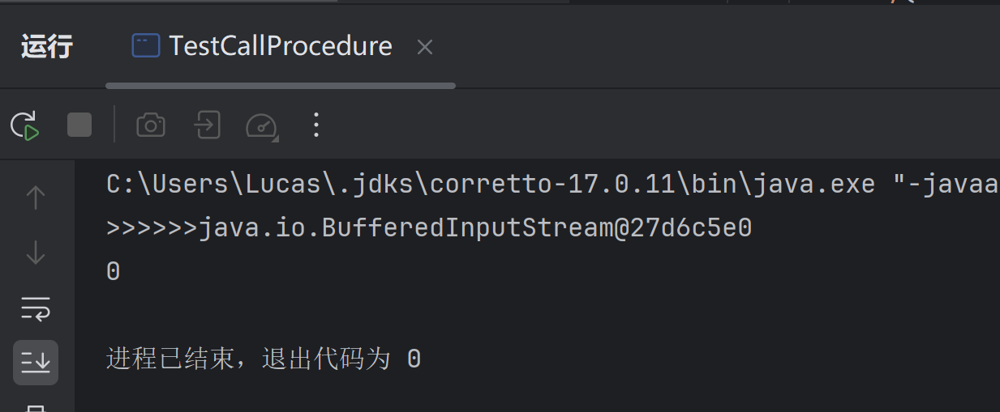
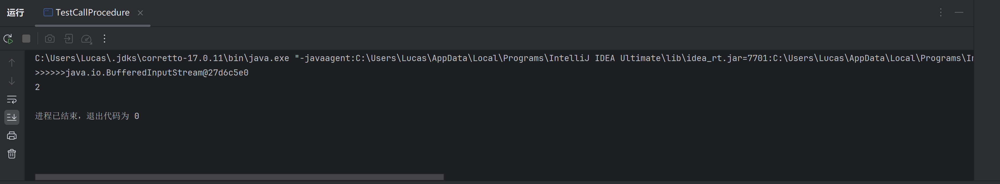

# JDBC

## 准备工作

##### 1.下载连接驱动 https://dev.mysql.com/downloads/file/?id=527658

##### 2.把.jar文件引入Java工程文件，并作为库

##### 3.创建一个数据库

```sql
-- 创建bank数据库
create database bank;
use bank;
```

## 连接数据库

##### 加载驱动

##### `mysql5` 写法 `com.mysql.jdbc.Driver`;

##### `mysql8`写法`com.mysql.cj.jdbc.Driver`

##### `url`地址一般是`jdbc:mysql://localhost:3306`,后面跟上数据库名

```java
public class TestConnection {
    public static void main(String[] args) {
        //mysql5 写法 com.mysql.jdbc.Driver
        String driver = "com.mysql.cj.jdbc.Driver"; //驱动就是一个类名
        String url = "jdbc:mysql://localhost:3306/bank";
        //用户名
        String user = "root";
        //密码
        String password = "123456";

        try {
            //1.加载驱动
            Class.forName(driver);
            //2.创建连接
            Connection connection = DriverManager.getConnection(url, user, password);
            //检查是否连接成功
            System.out.println("连接成功" + connection);
        } catch (Exception e) {
            e.printStackTrace();
        }
    }
}
```

##### 看见以下输出代表连接成功


## 插入数据

#### 数据库创建表

```sql
-- 创建表
create table account(
    accid int primary key auto_increment,
    accname varchar(30),
    password varchar(30),
    balance float,
    state int(1),
    accdata datetime
);
```

#### Java程序

##### 返回的是影响的列数，也就是有几条数据受到影响

##### 记得关闭`connection`和`statement`，后创建的先关闭；先创建的`connection`，后创建的`statement`;先删除`statement.close();`,再删除`connection.close();`

##### `sql`语句如果拿不准可以先在数据库查询控制台验证一下

##### `sql`插入语句本体

```sql
insert into account (accid, accname, password, balance, state, accdate)
values (1,'Lucas','123456',1000,1,now());
```

```java
package cn.guet.demo2;
import java.sql.Connection;
import java.sql.Driver;
import java.sql.DriverManager;
import java.sql.Statement;

/**
 * 目标：记录的插入，入库
 * 准备：先在MySQL创建表
 *
 * 步骤
 * 1.加载驱动
 * 2.创建连接
 * 3.创建statement
 * 4.执行SQL
 * 5.关闭
 */

public class TestInsert {
    public static void main(String[] args) {
        String driver = "com.mysql.cj.jdbc.Driver";
        String url = "jdbc:mysql://localhost:3306/bank";
        String user = "root";
        String password = "123456";

        //1.加载驱动
        try {
            //1.加载驱动
            Class.forName(driver);
            //2.创建连接
            Connection connection = DriverManager.getConnection(url,user,password);
            //3.创建statement
            Statement statement = connection.createStatement();
            //4.执行SQL
            String sql = "insert into account ( accname, password, balance, state, accdate)"+
                    "values ('Tom','45678',2000,0,now())";

            //执行SQL
            int rows = statement.executeUpdate(sql);
            //返回影响的行数
            System.out.println(">>>>rows" + rows);

            //关闭 释放资源
            statement.close();
            connection.close();

        } catch (Exception e) {
            e.printStackTrace();
        }
    }
}

```

## 修改数据

##### 只用修改sql语句就可以了

```java
package cn.guet.demo2;

import java.sql.Connection;
import java.sql.DriverManager;
import java.sql.Statement;

/**
 * DMl:insert update delete 更新操作 --- excuteUpdate()
 * DQL:select               查询操作 --- excuteQuery()
 * Statement
 */

public class Testupdate {
    public static void main(String[] args) {
        String driver = "com.mysql.cj.jdbc.Driver";
        String url = "jdbc:mysql://localhost:3306/bank";
        String user = "root";
        String password = "123456";

        //1.加载驱动
        try {
            //1.加载驱动
            Class.forName(driver);
            //2.创建连接
            Connection connection = DriverManager.getConnection(url,user,password);
            //3.创建statement
            Statement statement = connection.createStatement();
            //4.执行SQL
            String sql = "update account set accname = 'Sam',password = '66666' where accid = 3";

            //执行SQL返回影响的行数
            int rows = statement.executeUpdate(sql);
            System.out.println(">>>>rows" + rows);

            //关闭 释放资源
            statement.close();
            connection.close();

        } catch (Exception e) {
            e.printStackTrace();
        }
    }
}

```

## 删除数据

```java
package cn.guet.demo2;

import java.sql.Connection;
import java.sql.DriverManager;
import java.sql.Statement;

/**
 * 删除操作
 */

public class TestDelete {
    public static void main(String[] args) {
        String driver = "com.mysql.cj.jdbc.Driver";
        String url = "jdbc:mysql://localhost:3306/bank";
        String user = "root";
        String password = "123456";

        //1.加载驱动
        try {
            //1.加载驱动
            Class.forName(driver);
            //2.创建连接
            Connection connection = DriverManager.getConnection(url,user,password);
            //3.创建statement
            Statement statement = connection.createStatement();
            //4.执行SQL
            String sql = "delete from account where accid = 2";

            //执行SQL返回影响的行数
            int rows = statement.executeUpdate(sql);
            System.out.println(">>>>rows" + rows);

            //关闭 释放资源
            statement.close();
            connection.close();

        } catch (Exception e) {
            e.printStackTrace();
        }
    }
}

```

## 查询数据

##### 查询语句是`DQL`语句，不同于此前的`DML`语句

1. DMl:insert update delete    更新操作 --- excuteUpdate()
2. DQL:select              	       查询操作 --- excuteQuery()
##### excuteQuery()返回的是结果集(`ResultSet`)，需要使用`while`读取信息

##### `resultSet.next()`函数是查询下一列是否有数据，如果有数据返回`true`，没有返回`false`; 注意！默认游标指向第一行之前，也就是说从第一行之前开始遍历

##### `resultSet`也要记得关闭

```java
package cn.guet.demo3;

import java.sql.*;

/**
 * 目标：查询账户中所有记录并打印输出
 * 结果类
 */

public class TestSelect {
    public static void main(String[] args) {
        String driver = "com.mysql.cj.jdbc.Driver";
        String url = "jdbc:mysql://localhost:3306/bank";
        String user = "root";
        String password = "123456";

        //1.加载驱动
        try {
            //1.加载驱动
            Class.forName(driver);
            //2.创建连接
            Connection connection = DriverManager.getConnection(url,user,password);
            //3.创建statement
            Statement statement = connection.createStatement();
            //4.执行SQL 返回一个结果集 ResultSet
            String sql = "select * from account";
            ResultSet resultSet = statement.executeQuery(sql);
            //5.遍历result结果集 默认游标指向第一行之前
            while (resultSet.next()) {
                //获取当前游指向的记录数据
                //什么类型的数据用什么类型的变量接收
                int accid= resultSet.getInt(1); //1表示列的位置，从1开始
                String accname = resultSet.getString(2);
                String accpass = resultSet.getString(3);
                Float balance = resultSet.getFloat(4);
                int state= resultSet.getInt(5);
                Date date = resultSet.getDate(6);

                System.out.println(accid + "===" + accname + "===" + accpass + "===" + balance + "===" + state);
            }

            //6.关闭 释放资源
            resultSet.close();
            statement.close();
            connection.close();

        } catch (Exception e) {
            e.printStackTrace();
        }
    }
}

```

##### 运行结果


## 登录验证案例

##### 我们的目的是验证用户输入的用户名和密码是否相等，所以对应的sql语句是

```sql
select accid from account where accname= '"+username+"' and password='"+password+"'
```

##### 其中因为`sql`语句在`Java`中是字符串，我们传入数据需要通过`"+参数+"`的形式

### 封装连接语句和关闭语句

##### 在之前的代码中，我们多次连接数据库，和关闭数据库，其实可以把这部分的代码进行封装

- 1.单独创建`utils`文件夹
- 2.创建类

```java
package cn.guet.util;
import java.sql.*;

/**
 * 专门用于创建链接和关闭链接
 */

public class ConnectionUtils {
    private static String user = "root";
    private static String password = "123456";
    private static String driver = "com.mysql.cj.jdbc.Driver";
    private static String url = "jdbc:mysql://localhost:3306/bank";

    /**
     * 获取连接对象
     * @return connection
     */
    public static Connection getConn() {
        Connection connection = null;
        try {
            Class.forName(driver);
            connection = DriverManager.getConnection(url, user, password);
        } catch (Exception e) {
            e.printStackTrace();
        }
        return connection;
    }

    /**
     * 关闭链接 释放资源
     * @param conn
     * @param st
     * @param rs
     */
    public static void close(Connection conn, Statement st, ResultSet rs) {
        if (rs != null) {
            try {
                rs.close();
            } catch (SQLException e) {
                throw new RuntimeException(e);
            }
        }
        if (st != null) {
            try {
                st.close();
            } catch (SQLException e) {
                throw new RuntimeException(e);
            }
        }

        if(conn != null) {
            try {
                conn.close();
            } catch (SQLException e) {
                throw new RuntimeException(e);
            }
        }
    }
}


```

### 实现验证类

##### 我们让用户输入`username`和`password`,通过`sql`语句返回对应的accid，使用`resultSet.next()`判断是否有返回的resultSet数据集，如果有就会进入if判断，返回true，如果没有则不会进入if判断，返回false

##### 你可能会注意到一点，我们把`Statement statement = null; ResultSet resultSet = null;`放在`try`语句外面先声明，目的是如果他们在try语句里面，`finally`语句是无法找到`statement`和`resultSet`的，因为他们不在同一作用域，所以我们要把他放在try外面先声明

```java
package cn.guet.demo4;

import cn.guet.util.ConnectionUtils;

import java.sql.Connection;
import java.sql.ResultSet;
import java.sql.SQLException;
import java.sql.Statement;

/**
 * JDBC 应用案例
 * sql注入攻击
 * 1.实现非法登录，绕过验证
 * 2.特殊字符处理
 */

public class TestLogin0 {
    public static void main(String[] args) {
        String username = "Lucas"; 
       boolean isok = Login(username,"114514");
        System.out.println(isok);
    }

    /**
     * 验证用户名或密码是否匹配
     * @param username
     * @param password
     */
    public static boolean Login(String username, String password) {
        String sql = "select accid from account where accname= '"+username+"' and password='"+password+"'";
        System.out.println(">>>sql:"+sql);


        //获取连接
        Connection connection = ConnectionUtils.getConn();
        //创建Statement
        Statement statement = null;
        ResultSet resultSet = null;
        try {
            statement = connection.createStatement();
            resultSet = statement.executeQuery(sql);
            //判断是否有记录
            if(resultSet.next()) {
                System.out.println("===成功的===");
                return true;
            }
        } catch (SQLException e) {
            throw new RuntimeException(e);
        }finally {
            ConnectionUtils.close(connection,statement,resultSet);
        }
        return false;
    }
}
```

## sql注入

##### 这种方式从逻辑上并没有不妥，但是验证用户名密码是否正确本质上还是通过`sql`语句进行验证的，而恰恰用户输入的`username`和`password`是直接放入`sql`语句去执行的，这可能会导致用户输入特殊的用户名和密码去改变`sql`语句的正确性，比如如果用户名输入`' or 1=1 or ''=''`这个用户名，密码随意，那么它的`sql`语句就是`select accid from account where accname= '' or 1=1 or ''=''' and password='123456'`,在sql语句中or的优先级是要大于and的，1=1是true，'='也是true，password是false，最终sql得出的结果是true，也就是说虽然密码并不正确，但是sql语句还是得出了true的结果，从而得到所有的accid,其实具体是哪个accid并不重要，但是我们只是判断有没有accid从而得出用户名密码是否正确的结论，所以程序会执行true

##### 我们再想象一种情况，如果用户输入的用户名中包含特殊字符如单引号，程序是会抛出异常的，如果用户一直频繁登录，程序一直抛出异常，这对服务器的压力很大，严重的可能会使服务器宕机

##### 用户输入的用户名带单引号

```java
 public static void main(String[] args) {
        String username = "Lucas'";
       boolean isok = Login(username,"114514");
        System.out.println(isok);
    }
```

##### 程序会抛出异常


### sql注入类型

- 1.实现非法登录，绕过验证
- 2.特殊字符处理

### 解决方法

- 1.先通过用户名去查密码，然后和传入的密码匹配
- 2.使用预处理

### 先通过用户名去查密码，然后和传入的密码匹配

##### 在这里我们没有去使用and语句查询accid了，而是通过用户名去查密码，然后将数据库里的密码与用户输入的密码进行比对，从而判断用户名密码是否正确

```java
 	public static boolean Login(String username, String password) {
        //先通过用户名来查密码,然后再匹配密码
        String sql = "select password from account where accname= '"+username+"'";
        System.out.println(">>>sql:"+sql);


        //获取连接
        Connection connection = ConnectionUtils.getConn();
        //创建Statement
        Statement statement = null;
        ResultSet resultSet = null;
        try {
            statement = connection.createStatement();
            resultSet = statement.executeQuery(sql);
            //判断是否有记录
            if(resultSet.next()) { //用户名存在
                //取出密码
                String pass = resultSet.getString("password");
                if(password.equals(pass)) {
                    System.out.println("===成功的===");
                    return true;
                }
            }
        } catch (SQLException e) {
            throw new RuntimeException(e);
        }finally {
            ConnectionUtils.close(connection,statement,resultSet);
        }
        return false;
    }
```

### 预处理

##### 预处理是应对sql注入使用最普遍的方式，他有以下优点

* 1.防止sql注入
* 2.对于特殊字符处理
* 3.提高执行的效率

#### 插入数据

##### 我们先将sql语句写在外面，对于要写入的数据我们可以使用英文的问号?作为占位符，并且在外面先声明`PreparedStatement`

##### 如果我们多次插入相似的语句，预处理只要检查一次sql语句的语法完整性，后面只是往里面填入数据，这可以提升程序的运行效率

##### `setString`，`setInt`语句传入两个值，第一个值表示给第几个参数传值，这对应sql语句的顺序；第二个值表示传入的数据，数据类型必须对应参数要求的数据类型

```java
	public static void testInsert(){
        //?表示占位符
        String sql = "insert into account ( accname, password, balance, state, accdate)"+
                "values (?,?,?,?,?)";

        //创建连接
        Connection conn = ConnectionUtils.getConn();
        //创建PreparedStatement === 注意：需要提前传入sql
        PreparedStatement pst = null;
        try {
            pst = conn.prepareStatement(sql); //预编译处理
            //在执行之前，先要给占位符赋值
            pst.setString(1,"曹操");
            pst.setString(2,"123456");
            pst.setFloat(3,2000);
            pst.setInt(4,1);
            pst.setDate(5,new Date(System.currentTimeMillis()));

            int rows = pst.executeUpdate();

            System.out.println(rows);
        } catch (SQLException e) {
            throw new RuntimeException(e);
        }finally {
            ConnectionUtils.close(conn,pst,null);
        }
    }
```

#### 修改数据

```java
	public static void testUpdate(){
        //?表示占位符
        String sql = "update account set password=? where accid=?";

        //创建连接
        Connection conn = ConnectionUtils.getConn();
        //创建PreparedStatement === 注意：需要提前传入sql
        PreparedStatement pst = null;
        try {
            pst = conn.prepareStatement(sql); //预编译处理
            //在执行之前，先要给占位符赋值
            pst.setString(1,"114514");
            pst.setInt(2,1);

            int rows = pst.executeUpdate();

            System.out.println(rows);
        } catch (SQLException e) {
            throw new RuntimeException(e);
        }finally {
            ConnectionUtils.close(conn,pst,null);
        }
    }
```

#### 删除数据

```java
    public static void testDelete(){
        //?表示占位符
        String sql = "delete from account where accid=?";

        //创建连接
        Connection conn = ConnectionUtils.getConn();
        //创建PreparedStatement === 注意：需要提前传入sql
        PreparedStatement pst = null;
        try {
            pst = conn.prepareStatement(sql); //预编译处理
            //在执行之前，先要给占位符赋值
            pst.setInt(1,6);

            int rows = pst.executeUpdate();

            System.out.println(rows);
        } catch (SQLException e) {
            throw new RuntimeException(e);
        }finally {
            ConnectionUtils.close(conn,pst,null);
        }
    }
```

#### 预处理的应用

```java
package cn.guet.demo5;

import cn.guet.util.ConnectionUtils;

import java.sql.Connection;
import java.sql.PreparedStatement;
import java.sql.ResultSet;
import java.sql.SQLException;

/**
 * 使用预处理来实现登录逻辑，验证是否能解决sql注入问题
 */

public class testLogin {
    public static void main(String[] args) {
        String username = "' or 1=1 or ''=''";
        boolean isok = login(username,"12345");
        System.out.println(isok);
    }

    public static boolean login(String username, String password) {
        // -----------区别1：sql 换成占位符 -----------
        String sql = "select * from account where accname=? and password=?";
        Connection conn = ConnectionUtils.getConn();

        try {
            // --------------区别2：提前去传入sql进行预处理，预编译------------------
            PreparedStatement pst = conn.prepareStatement(sql);
            //-------------------区别3：在执行前进行占位符赋值-----------------------
            pst.setString(1, username);
            pst.setString(2, password);

            //--------------区别4：执行时，不再传入sql------------------
            // 执行 返回结果集
            ResultSet resultSet = pst.executeQuery();
            if(resultSet.next()) {
                System.out.println("成功");
                return true;
            }

            ConnectionUtils.close(conn,pst,resultSet);

        } catch (SQLException e) {
            throw new RuntimeException(e);
        }

        return false;
    }
}

```

## 银行转账案例

##### 我们使用预处理进行两个用户的转账操作，比如Sam用户向Lucas用户转入500元，他们对应`sql`操作是

```sql
update account set balance = balance + 500 where accname = "Lucas";
```

```sql
update account set balance = balance - 500 where accname = "Sam"
```

##### 我们可以发现，他们的sql语句很相似，只有`balance`和`accname`不一样，这是使用预处理的前提

##### 所以预处理的代码是

```java
 String sql = "update account set balance = balance + ? where accname = ?";
```

```java
package cn.guet.demo6;

import cn.guet.util.ConnectionUtils;

import java.sql.Connection;
import java.sql.PreparedStatement;
import java.sql.SQLException;

/**
 * 本类实现：模拟银行转账业务逻辑
 * 事务
 */

public class TestBankTrans {
    public static void main(String[] args) throws SQLException {
        String sql = "update account set balance = balance + ? where accname = ?";
        // 获取链接
        Connection conn = ConnectionUtils.getConn();
        // 创建预处理
        PreparedStatement pst = conn.prepareStatement(sql);
        // 给占位符赋值
        pst.setFloat(1, 500);
        pst.setString(2,"Lucas");
        //执行
        int rows = pst.executeUpdate();
        
        // 给Sam用户减500
        pst.setFloat(1,-500);
        pst.setString(2,"Sam");
        int  i = pst.executeUpdate();

        System.out.println(rows+"===" + i);
        ConnectionUtils.close(conn,pst,null);
    }

}
```

##### 代码整体上很好理解，我们利用`balance+-金额`实现金额的改变，先让Lucas加500元，再让Sam减500元，并返回数据库改变的列数

##### 从逻辑上当然没什么问题，但是对于多并发的场景如果中途程序出现异常是会造成麻烦的

##### 比如，如图我们在第一个转账操作执行后手动抛出异常，那么`"".substring(12)`下面的代码是不会执行的，但是Lucas的转账操作已经执行了，但Sam的转账操作不会执行，因此程序出现bug

```java
 pst.setFloat(1, 500);
        pst.setString(2,"Lucas");
        //执行
        int rows = pst.executeUpdate();

        "".substring(12); // 主动抛出异常

        // 给Sam用户减500
        pst.setFloat(1,-500);
        pst.setString(2,"Sam");
        int  i = pst.executeUpdate();
```

### 解决方法

##### 我们的想法是转账操作要么都完成，要么都不完成，如果只有一方完成了，另一方未完成，需要进行回滚，回到初始状态；这里通过`事务`来解决

#### 事务的四大特性

- 原子性：指事务是数据库的逻辑工作单位，事务中包括的操作要么都做，要么都不做，不可分割。这确保了事务中包含的程序要么全部执行，要么完全不执行，保持了操作的原子性。
- 一致性：指事务执行的结果必须是使数据库从一个一致性状态变到另一个一致性状态。这保证了事务在完成时，必须使所有的数据保持一致状态，即数据的完整性和一致性得到维护。
- 隔离性：指并发的事务是互相隔离的，一个事务的执行不能被其他事务干扰。这确保了即使多个事务并发执行，它们之间也是相互独立的，每个事务都有各自完整的数据空间，保证了并发执行的事务之间不能互相干扰。
- 持久性：指一旦事务提交后，它对数据库中的数据改变就应该是永久的。即使系统或介质发生故障时，已提交事务的更新不会丢失，保证了数据的持久性和稳定性。

##### 我们使用`conn.setAutoCommit(false)`关闭自动提交事务，也就是只有我们允许提交事务时，才会进行数据库的数据更改，当所有的操作都完成后，再通过`conn.commit()`手动提交事务，在下方`catch`语句使用`conn.rollback()`进行数据回滚，如果转账操作发生异常抛出错误，就执行回滚操作
```java
package cn.guet.demo6;

import cn.guet.util.ConnectionUtils;

import java.sql.Connection;
import java.sql.PreparedStatement;
import java.sql.SQLException;

public class TestTransaction {
    public static void main(String[] args) {
        String sql = "update account set balance = balance + ? where accname = ?";
        // 获取链接
        Connection conn = ConnectionUtils.getConn();
        PreparedStatement pst = null;
        try {
            // 关闭自动提交 手动提交
            conn.setAutoCommit(false);

            // 创建预处理
            pst = conn.prepareStatement(sql);
            // 给占位符赋值
            pst.setFloat(1, 500);
            pst.setString(2, "Lucas");
            //执行
            int rows = pst.executeUpdate(); // -------不再自动提交事务--------

//            "".substring(12); // 主动抛出异常

            // 给Sam用户减500
            pst.setFloat(1, -500);
            pst.setString(2, "Sam");
            int i = pst.executeUpdate();

            // 提交事务
            conn.commit(); // --------手动提交事务--------

            System.out.println(rows + "===" + i);
        }
        catch (Exception e) {
            try {
                // 事务回滚
                conn.rollback(); // --------事务回滚，恢复到初始状态--------
            } catch (SQLException ex) {
                throw new RuntimeException(ex);
            }
        }
        finally {
            ConnectionUtils.close(conn, pst, null);
        }
    }
}

```

## 批量插入数据

##### 在下面案例中，我们定义了两个函数`test1()`和`test2()`，`test1()`是一次插入单条数据，也就是Java这边一条一条往数据库里插入数据；`test2()`是批量插入数据。我们一次性插入十万条数据，比较两种方式的用时

##### 实验结果是`test1()`用时476226ms，`test2()`用时14939ms。差距十分巨大

##### `test2()`里关闭了自动提交，将原先提交`sql`语句`pst.executeUpdate()`更换成了` pst.addBatch()`,使用` pst.executeBatch()`批量进行sql语句的操作，同时由于所有的数据是先缓存到内存中，如果数据量过大可能会造成内存溢出，解决办法是每6000条数据执行` pst.executeUpdate()`，同时也可以提交事务

```java
package cn.guet.demo7;

import cn.guet.util.ConnectionUtils;

import java.sql.Connection;
import java.sql.PreparedStatement;
import java.sql.SQLException;

public class TestBatch01 {
    public static void main(String[] args) {
        long startTime = System.currentTimeMillis(); // 开始时间

        test2(100000);

        long endTime = System.currentTimeMillis(); // 结束时间

        System.out.println("耗时：" + (endTime - startTime) + "ms");
    }

    /**
     * count：插入的记录数
     * 普通的单条插入
     * 10万条数据插入耗时：476226ms
     */

    public static void test1(int count) {
        String sql = "insert into account(accname, password, balance, state, accdate) values(?,?,?,?,now())";
        Connection conn = ConnectionUtils.getConn();
        PreparedStatement pst = null;

        try {
            pst = conn.prepareStatement(sql);
            for (int i = 1; i <= count; i++) {
                pst.setString(1, i + "name");
                pst.setString(2, i + "pwd");
                pst.setFloat(3, 1000);
                pst.setInt(4, 1);

                //执行
                pst.executeUpdate();
            }

        }
        catch (SQLException e) {
            throw new RuntimeException(e);
        }
        finally {
            ConnectionUtils.close(conn, pst, null);
        }
    }

    /**
     * count：插入的记录数
     * 使用批量插入
     * 10万条数据插入耗时：14939ms
     *
     * 注意：内存溢出问题
     */

    public static void test2(int count) {
        String sql = "insert into account(accname, password, balance, state, accdate) values(?,?,?,?,now())";
        Connection conn = ConnectionUtils.getConn();
        PreparedStatement pst = null;

        try {
            // 1.先关闭自动提交
            conn.setAutoCommit(false);


            pst = conn.prepareStatement(sql);
            for (int i = 1; i <= count; i++) {
                pst.setString(1, i + "name");
                pst.setString(2, i + "pwd");
                pst.setFloat(3, 1000);
                pst.setInt(4, 1);

                //执行
//                pst.executeUpdate();
                pst.addBatch(); // 2.把要添加的记录先放入缓存

                if((i + 1) % 6000 == 0){ // 每6000次 执行一次
                    pst.executeBatch();
                    conn.commit(); // 避免内存溢出
                }
            }

            // 3.批量的执行
            pst.executeBatch();


            // 4.提交事务
            conn.commit();

        }
        catch (SQLException e) {
            throw new RuntimeException(e);
        }
        finally {
            ConnectionUtils.close(conn, pst, null);
        }
    }
}

```

## 配置资源文件

##### 在真实的业务场景中，我们可能会频繁修改数据库的连接参数，比如修改用户名或密码，这时候在Java文件中修改并不方便，更坏的是甚至还不一定能修改，所以我们将这些参数整合为资源配置文件

##### 在Src文件夹中右键新建“文件”，命名为`db.properties`,在文件中添加连接数据库的必要参数

```
url = jdbc:mysql://localhost:3306/bank
driver = com.mysql.cj.jdbc.Driver
user = root
password = 123456
```
##### 此时原来ConnectionUtils我们的静态成员变量就可以替换为配置文件的内容

```java
    private static String user = "rootxx";
    private static String password = "123456xx";
    private static String driver = "com.mysql.cj.jdbc.Driverxx";
    private static String url = "jdbc:mysql://localhost:3306/bankxx";

	// static函数只会执行一次，我们在整个程序中执行一次就可以了
    static {
        InputStream is = ConnectionUtils.class.getResourceAsStream("/db.properties");
        Properties prop = new Properties();
        try {
            prop.load(is);
            System.out.println(">>>>>>" + is);
            user = prop.getProperty("user");
            password = prop.getProperty("password");
            driver = prop.getProperty("driver");
            url = prop.getProperty("url");

        } catch (IOException e) {
            throw new RuntimeException(e);
        }
    }
```

##### 连接性测试

```java
package cn.guet.demo8;

import cn.guet.util.ConnectionUtils;

import java.sql.Connection;
import java.sql.PreparedStatement;
import java.sql.ResultSet;

/**
 * 通过读取配置文件获取JDBC参数
 *1.配置资源文件 db.properties
 * 2.加载配置文件，读取配置信息
 *
 * 注意：修改的是ConnectionUtils
 */

public class TestProperties {
    public static void main(String[] args) {
        // try-with-resources 自动在finally中关闭
        try(
               	Connection conn = ConnectionUtils.getConn();
                PreparedStatement ps = conn.prepareStatement("select * from account");
        ){
            ResultSet rs = ps.executeQuery();
            if(rs.next()){
                System.out.println("读取成功");
            }
        }catch (Exception e){
            e.printStackTrace();
        }
    }
}

```

## 存储过程

### 调用无参存储过程

##### 对应sql代码,这段代码是创建一个新表`account_backup`，并把`account`表所有的数据拷贝给新表

```sql
create procedure create_back()
begin
    drop table if exists account_backup;
    create table account_backup select * from account;
end;

-- 调用存储过程
call create_back;
```

##### 我们使用`CallableStatement`来处理存储过程，使用`executeUpdate`调用

```java
    public static void callNoParamProcedure() {
       try(Connection conn = ConnectionUtils.getConn()){
           // 创建可以执行存储过程的声明对象
           CallableStatement cs = conn.prepareCall("call create_back");
           // 执行
           int i = cs.executeUpdate();

           System.out.println(i);
       }
        catch(Exception e){
           e.printStackTrace();
        }
    }
```

### 调用有参存储过程

##### sql代码,这是之前转账的案例，这里我们传入`money`,`fromAcc`,`toAcc`三个参数，并且开启事务

```sql
-- 修改表 添加检查约束 余额不能为负数
alter table account add constraint ck_balance check ( balance > 0 );

-- 存储过程 转账多次 当余额小于0时，会触发检查约束，异常
drop procedure if exists transfer;
create procedure transfer(money float, fromAcc int, toAcc int)
begin
    # 开启事务
    start transaction ;
    update account set balance = balance + money where accid = toAcc;
    update account set balance = balance - money where accid = fromAcc;

    # 提交事务
    commit ;
end;

-- 调用存储过程
call transfer(500,1,2);
```

##### 调用方法也很简单,利用？占位符，后面传参就可以了

```java
    public static void paramProcedure() {
        try(Connection conn = ConnectionUtils.getConn()){
            CallableStatement cs = conn.prepareCall("call transfer(?,?,?)");
            cs.setFloat(1,500);
            cs.setInt(2,1);
            cs.setInt(3,2);
            int i = cs.executeUpdate();
            System.out.println(i);
        }
        catch(Exception e){
            e.printStackTrace();
        }
    }
```



##### 以上代码如果你去运行，你会发现终端输出的是0，这并不代表调用没成功，因为mysql那边返回的结果就是0，但是我们想返回正确的更新行数该怎么办？

### 存储过程返回结果

##### 对应sql语句,还是之前那个转账的存储过程，我们这次传入四个参数，多了一个返回的参数`res`,我们声明`affect_rows`变量，用于获取每一次转账操作变化的行数，`select row_count() into affect_rows; -- 获取影响行数`,并进行累加操作

```sql
create procedure transferOutParam(money float, fromAcc int, toAcc int, out res int)
begin
    declare affect_rows int default 0; -- 声明语句必须放在语句前面
    set res = 0;

    # 开启事务
    start transaction ;
    update account set balance = balance + money where accid = toAcc;
    select row_count() into affect_rows; -- 获取影响行数
    set res = res + affect_rows; -- 累计影响的行数

    update account set balance = balance - money where accid = fromAcc;
    select row_count() into affect_rows;
    set res = res + affect_rows;  -- 累计最近更新的行数

    # 提交事务
    commit ;
end;

-- 调用out参数的过程
call transferOutParam(500,2,1,@res);
select @res;
```

##### 我们使用getInt接收存储过程返回的参数,使用`registerOutParameter`注册out出参

```java
    public static void paramsInOutProcedure() {
        try(Connection conn = ConnectionUtils.getConn()){
            CallableStatement cs = conn.prepareCall("call transferOutParam(?,?,?,?)");
            cs.setFloat(1,500);
            cs.setInt(2,2);
            cs.setInt(3,1);
            // 注册out出参
            cs.registerOutParameter(4, Types.INTEGER);

            cs.executeUpdate();

            // 获取out参数结果
            int anInt = cs.getInt(4);

            System.out.println(anInt);
        }
        catch(Exception e){
            e.printStackTrace();
        }
    }
```

##### 这下能正确返回影响的行数

### 存储过程里使用select语句返回结果

##### 对应sql语句,输入用户id，返回他的id，姓名，余额信息

```sql
create procedure getInfo(aid int)
begin
    select accid, accname, balance from account where accid = aid;
end;

call getInfo(1);
```

##### 其实用正常的获取select结果的方式就可以了，注意，这里调用存储过程用的是`executeQuery`

```java
public static void paramsGetResult() {
    try(Connection conn = ConnectionUtils.getConn()){
        CallableStatement cs = conn.prepareCall("call getInfo(?)");
        cs.setInt(1, 1);

        // 执行查询，返回结果集
        ResultSet resultSet = cs.executeQuery();
        if(resultSet.next()) {
            int accid = resultSet.getInt(1);
            String accname = resultSet.getString(2);
            float balance = resultSet.getFloat(3);
            System.out.println(accid + " " + accname + " " + balance);
        }
    }
    catch(SQLException e){
        e.printStackTrace();
    }
}
```



## 结果集

##### 以往我们都知道一张表的表头字段名是什么，也知道他的字段类型，但是倘若我们不知道这些，如何通过返回的`resultSet`得知这些信息？

##### 以往我们获取结果都是使用ResultSet类，要知道他的元数据，我们使用`ResultSetMetaData`类，使用`getMetaData`方法，从结果集中得到元数据

##### `getColumnCount`会返回得到元数据的列数，可以使用for循环依次得到结果，注意下标从1开始

##### `getColumnName`获取他的字段名，`getColumnType`获取他的字段名的数据类型（注意，他返回的是编号，需要你去查），`getColumnLabel`获取字段名取的别名（如果有），`getTableName`获取表的名字

```java
public class TestResultSet {
    public static void main(String[] args) {
        String sql = "select accid,accname name,password from account";
        query(sql);
    }

    public static void query(String sql){
        Connection conn = ConnectionUtils.getConn();
        PreparedStatement ps = null;
        ResultSet rs = null;
        try {
            ps = conn.prepareStatement(sql);
            rs = ps.executeQuery();
           // 获取元数据对象
            ResultSetMetaData metaData = rs.getMetaData();
            // 获取列数
            int columnCount = metaData.getColumnCount();
            System.out.println(columnCount);

            for (int i = 1; i <= columnCount; i++) {
                String columnName = metaData.getColumnName(i); // 从一开始的
//                int columnType = metaData.getColumnType(i);
                String labelName = metaData.getColumnLabel(i);
                System.out.println(columnName + " " + labelName);
            }

            // 获取表的名字
            String tableName = metaData.getTableName(1);
            System.out.println("表名：" + tableName);

        } catch (SQLException e) {
            throw new RuntimeException(e);
        }
        finally {
            ConnectionUtils.close(conn,ps,rs);
        }

    }
}
```

## DAO

##### DAO，全称DataBase Access Object，数据库访问对象，是操作数据库的底层类，是整个业务的最底层，一般直接跟数据库打交道，传入SQL语句，获取结果集等操作

##### 一般操作数据库无非两个操作，查询数据和修改数据，所以在DAO类我们会着重封装这两个函数

#### 修改数据

##### 这里大部分的步骤应该是能看懂的，但是对于`update`函数，以往我们只会传入sql语句，但是这次我们会传入Object对象，原因在于我们这个修改语句是一个通用的函数，它是位于最底层的代码，我们要处理sql语句传参的情况，但是我们并不知道传进来的数据是什么数据类型，有多少？因此我们统一以对象的方式传进来

##### 既然传参了，我们就需要赋值，以前我们知道，我们是通过setInt,setString这些方式赋值，但是我们传进来的是对象，所以我们可以通过for循环遍历对象，再通过` ps.setObject(i+1, params[i])`的方式赋值

##### 开启事务，如果对于以前像银行转账那种案例，我们是需要开启事务的，同时还要有回滚的操作

##### 为了代码的复用性，我们封装两个函数`setAutoCommit`和`commit`，第一个函数用于更改是否开启事务，第二个函数用于判断是否开启事务，如果开启就手动提交sql语句

```java
    /**
     * 设置是否自动提交
     * @param isAutoCommit
     */
    public void setAutoCommit(boolean isAutoCommit) {
        isAutoCommit = isAutoCommit;
    }

    /**
     * 单独封装
     */
    public void commit(){
        if(isAutoCommit && conn != null){
            try {
                conn.commit();
            } catch (SQLException e) {
                throw new RuntimeException(e);
            }
        }
    }
```
##### 如果开启事务，我们还需要添加回滚操作，也就是当程序抛出异常时进行回滚操作

```java

    public int update(String sql, Object... params) {
        System.out.println("SQL:" + sql);
        System.out.println("Params:" + Arrays.toString(params));

        // 连接
        conn = getConnection();
        // 声明 PreparedStatement
        try{
            // 设置是否自动提交
            conn.setAutoCommit(isAutoCommit);

            ps = conn.prepareStatement(sql);
            // 给占位符赋值
            if(params != null) {
                for(int i = 0;i<params.length;i++){
                    ps.setObject(i+1, params[i]);
                }
            }

            int i = ps.executeUpdate();
            return i;
        }
        catch(Exception e){
            if(!isAutoCommit){
                try {
                    conn.rollback();
                } catch (SQLException ex) {
                    throw new RuntimeException(ex);
                }
            }
            e.printStackTrace();
        }
        finally {
            close();
        }
        // 执行sql
        return 1;
    }
```

#### 查询数据

##### 其他的部分和修改数据没什么区别，这里有个大坑，以往我们查询完数据会立刻关闭数据库连接，但是这里我们返回的是结果集，数据是一条一条的给到中间层的，如果我们此时关闭连接，那中间层得不到任何数据，所以最好的方法就是让用户自行选择关闭，而不是在这里关闭

```java
    public ResultSet query(String sql, Object... params) {
        System.out.println("SQL:" + sql);
        System.out.println("Params:" + Arrays.toString(params));
        // 连接
        conn = getConnection();
        // 声明 PreparedStatement
        try {
            ps = conn.prepareStatement(sql);
            // 先给占位符赋值
            if(params != null) {
                for(int i = 0;i<params.length;i++){
                    ps.setObject(i+1, params[i]);
                }
            }
            // 执行sql
            rs = ps.executeQuery();
            return rs;

        } catch (Exception e) {
            throw new RuntimeException(e);
        } finally {
            // close();
        }
    }
```

#### DAO层代码全貌

```java
package cn.guet.demo10;

import cn.guet.util.ConnectionUtils;

import java.sql.*;
import java.util.Arrays;

/**
 * DAO:Database Access Object 数据库访问对象
 * 操作数据库的底层类
 * 两大类：
 * 1.更新操作 insert update delete
 * 2.查询操作 select
 */

public class BaseDao {
    private String username = "root";
    private String password = "123456";
    private String url = "jdbc:mysql://127.0.0.1:3306/bank";
    private String driver = "com.mysql.cj.jdbc.Driver";

    private Connection conn ;
    private PreparedStatement ps ;
    private ResultSet rs ;

    private boolean isAutoCommit = true;

    /**
     * 设置是否自动提交
     * @param isAutoCommit
     */
    public void setAutoCommit(boolean isAutoCommit) {
        isAutoCommit = isAutoCommit;
    }

    /**
     * 单独封装
     */
    public void commit(){
        if(isAutoCommit && conn != null){
            try {
                conn.commit();
            } catch (SQLException e) {
                throw new RuntimeException(e);
            }
        }
    }
    /**
     * 连接函数
     * @return
     */
    public Connection getConnection() {
        try {
            if (conn == null || conn.isClosed()) {
                Class.forName(driver);
                conn = DriverManager.getConnection(url, username, password);
            }
            return conn;
        }
        catch(Exception e){
            e.printStackTrace();
        }
        return null;
    }

    public int update(String sql, Object... params) {
        System.out.println("SQL:" + sql);
        System.out.println("Params:" + Arrays.toString(params));

        // 连接
        conn = getConnection();
        // 声明 PreparedStatement
        try{
            // 设置是否自动提交
            conn.setAutoCommit(isAutoCommit);

            ps = conn.prepareStatement(sql);
            // 给占位符赋值
            if(params != null) {
                for(int i = 0;i<params.length;i++){
                    ps.setObject(i+1, params[i]);
                }
            }

            int i = ps.executeUpdate();
            return i;
        }
        catch(Exception e){
            if(!isAutoCommit){
                try {
                    conn.rollback();
                } catch (SQLException ex) {
                    throw new RuntimeException(ex);
                }
            }
            e.printStackTrace();
        }
        finally {
            close();
        }
        // 执行sql
        return 1;
    }

    public ResultSet query(String sql, Object... params) {
        System.out.println("SQL:" + sql);
        System.out.println("Params:" + Arrays.toString(params));
        // 连接
        conn = getConnection();
        // 声明 PreparedStatement
        try {
            ps = conn.prepareStatement(sql);
            // 先给占位符赋值
            if(params != null) {
                for(int i = 0;i<params.length;i++){
                    ps.setObject(i+1, params[i]);
                }
            }
            // 执行sql
            rs = ps.executeQuery();
            return rs;

        } catch (Exception e) {
            throw new RuntimeException(e);
        } finally {
            // close();
        }
    }

    /**
     * 关闭连接
     */

    public  void close(){
        try{
            if(rs != null){
                rs.close();
                rs = null;
            }
            if(ps != null){
                ps.close();
                ps = null;
            }
            if(conn != null){
                conn.close();
                conn = null;
            }
        }
        catch (Exception e){
            e.printStackTrace();
        }
    }
}

```

#### 中间层调用DAO层代码

##### 在中间层我们能很轻松获取数据库数据，开发人员只需要关注业务本身，不需要关注数据库连接，搭建这些事

##### 我们定义了`String sql = "select * from account where accid = ?";`sql语句，通过` ResultSet rs = dao.query(sql,1);`方式查询accid=1的数据，再通过结果集返回数据并解析

##### 注意：传参数据类型是对象，如果只有一个数据无所谓，但是如果有一个以上的数据就需要以对象的形式传入

```java
package cn.guet.demo10;


import java.sql.ResultSet;
import java.util.Date;

/**
 *
 */

public class TestBaseDao {
    public static void main(String[] args) {
        String sql = "select * from account where accid = ?";


        BaseDao dao = new BaseDao();
        ResultSet rs = dao.query(sql,1);

        try{
            while (rs.next()){
                String id = rs.getString("accid");
                String name = rs.getString("accname");
                String pwd = rs.getString("password");
                String balance = rs.getString("balance");
                String state = rs.getString("state");
                String time = rs.getString("accdate");
                System.out.println(id + " " + name + " " + pwd + " " + balance + " " + state + " " + time + " ");
            }
        } catch(Exception e){
            e.printStackTrace();
        } finally {
            dao.close();
        }

    }

    public static void test(String[] args) {
        String sql = "insert into account (accname,password,balance,state,accdate) value(?,?,?,?,?)";

        Object[] params = {"Andy","123456789",1200,1,new Date()};
        BaseDao dao = new BaseDao();
        dao.setAutoCommit(false);
        int update = dao.update(sql,params);

        // 提交
        dao.commit();
        System.out.println(update);
    }
}

```

# ---完---
